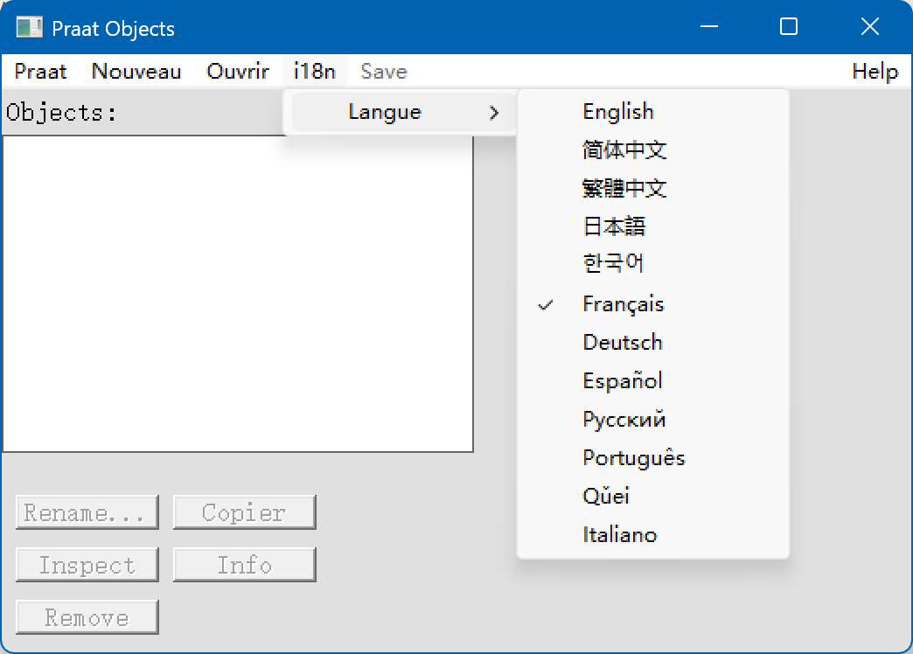
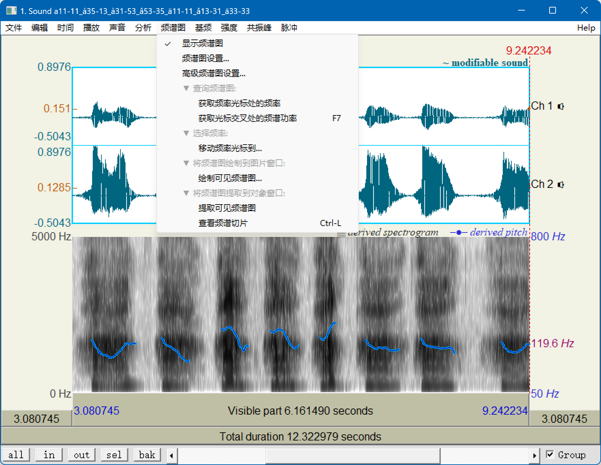

# Praat Internationalization (i18n) Guide

Praat supports multilingual UI, dynamic language switching and easy extension. This guide covers directory structure, adding new languages/translation, menu switching, python helper scripts, and sample configs.

## Multilingual UI Screenshots

Main window language menu example:



Editor window in Simplified Chinese:



---

## 1. Directory Structure
```
sys/language_packs/
├─ en-US.json          # English
├─ zh-CN.json          # Simplified Chinese
├─ ko-KR.json, ja-JP.json ...
├─ languages.json      # Language registry/mapping
├─ batch_translate_de.py, comprehensive_translate_de.py
├─ compare_translations.py
```

### Example languages.json
```json
{
  "languages": [
    { "code": "en-US", "name": "English", "file": "en-US.json" },
    { "code": "zh-CN", "name": "简体中文", "file": "zh-CN.json" },
    ...
  ],
  "default": "en-US"
}
```

### Example zh-CN.json
```json
{
  "menu.praat": "Praat",
  "menu.new": "新建",
  "menu.save": "保存",
  ...
}
```

---

## 2. How to Add a New Language
1. **Duplicate** an existing JSON (e.g. copy `en-US.json` as `fr-FR.json` and translate values)
2. **Register** in languages.json:
```json
{ "code": "fr-FR", "name": "Français", "file": "fr-FR.json" }
```
3. **Ensure all keys are present** (see scripts below)

---

## 3. Language Switching
- Use the “i18n” or “Language” menu to switch at runtime
- Selection saved in `praat_language_preference.txt`
- If not effective try restarting the program

---

## 4. Compile & Helper Scripts
- `compile_praat.bat`: checks env, full build, lists available packs and test tips
- `quick_compile.bat`: kills Praat, quick compile
- `clean_praat.bat`: cleans temp/debug/pref files

---

## 5. Python Helpers
- `batch_translate_de.py`: batch fill keys for German, serves as sample, copy for others
- `comprehensive_translate_de.py`: rule/auto fill, extensible
- `compare_translations.py` example usage:
  ```bash
  python compare_translations.py en-US.json zh-CN.json "Chinese"
  ```
  Lists untranslated/missing/short keys.

---

## 6. Typical key mapping
```json
// en-US.json
{
  "menu.praat": "Praat",
  "menu.save": "Save",
  "menu.language": "Language",
  "label.confirm": "Are you sure?",
  ...
}
// zh-CN.json
{
  "menu.praat": "Praat",
  "menu.save": "保存",
  "menu.language": "语言",
  "label.confirm": "您确定吗？",
  ...
}
```

---

## 7. Testing & Contribution
- Use compare_translations.py to check keys before publishing a new pack
- Test all menus/pages in new language
- Debug info: `debug_i18n_simple.txt`
- Submit as PR with full json and languages.json

More scripting/automation/best practice: welcome to discuss via Issues!

## Translation Progress Table

Major languages automatic key count (using en-US as baseline):

| Language     | Key Count | Coverage | Notes                       |
|--------------|-----------|----------|-----------------------------|
| English      | 1999      | 100%     | Baseline                    |
| Simplified Chinese | 1999      | 99.9%+   | Fully translated UI         |
| Other major  | 1800~1990 | ≥90%     | A few menus/help lines left |
| Qǔei/lk-CN   | 1~1000    | DEMO     | Sample/incomplete           |

> Note: Use compare_translations.py regularly to ensure 99%+ key coverage.
